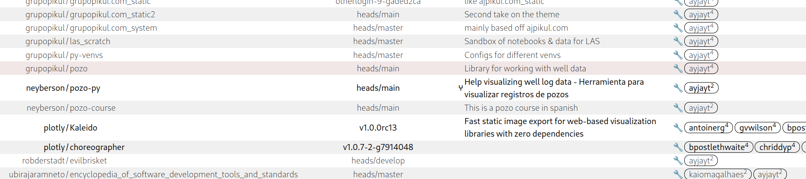
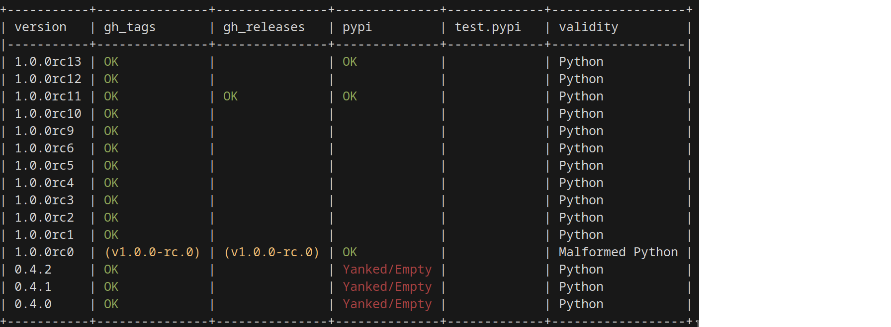
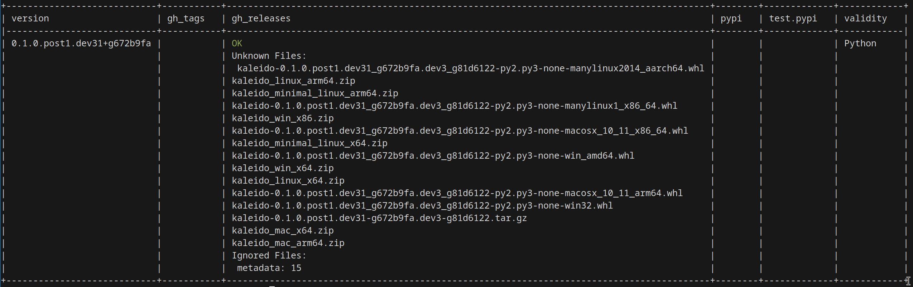

*github-helper* is an API connector to help engineering managers quickly check the
status of one or ALL repositories at the same time.

It has a python, CLI, json, and HTML interface.

### Supported Interfaces:

  - local git repo
  - git tags via github
  - github releases
  - pypi
  - pypi testing
  - conda

### Version Auditing

It ensures that versions are the same across sources, and that the builds are
also the same (same platforms supported). It notified you of discrepancies.

It allows you to set template rules for github and audits your rulesets to make
sure they are in conformance.

In fact, it can provide a tree-diff for any type of configuration file
(pre-commits, GHA, etc).

It allows you to check its access level (public private archived), as well as
who has access.

### Example Repo HTML Interface

[Example](docs/repos.html)

### Example Version Audit

### Example Single-Version Inspection (Incomplete)

